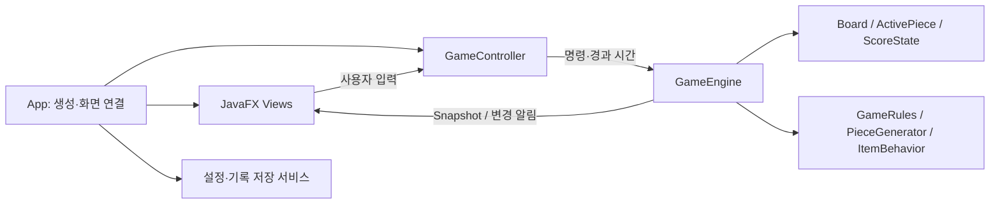

# 테트리스 팀 프로젝트 코드 검토와 2차 개발 계획

검토일: 2026-10-08. 이 문서는 팀 합의를 위한 제안이며, 실제 회의나 승인 기록을 대신하지 않는다. 이번 작업은 코드 검토와 개발 방향 결정이다. 게임 소스 수정, 원격 이슈 작성, PR 생성 및 병합은 수행하지 않았다.

## 1. 결정 제안

현재 Java 21 / JavaFX / Gradle 프로젝트를 유지하고 **MVC를 주 아키텍처로 적용**한다. 게임 도메인 내부에서는 난이도·생성·점수 규칙에 Strategy를, 아이템 효과에 다형성을 사용한다. 게임 상태는 JavaFX와 파일 입출력에 의존하지 않는다. 모든 패턴을 한꺼번에 적용하기보다, 점수 및 난이도 기능부터 작은 PR로 개선한다.

현재 `game` 패키지가 UI에 의존하지 않는 점은 좋은 출발점이다. 다만 `GameView`가 그리기·키 입력·시간 누적·일시정지·종료 감지를 함께 맡는다. 이 입력 및 진행 조정을 `GameController`로 옮기면 MVC 선택을 코드로 설명할 수 있다. `App`은 객체 생성과 화면 연결을 담당한다.

수업의 근거는 `05_architecture_design_impl.pdf` 4, 10, 12–16, 35–41쪽이다. 요구사항과 비기능 특성에 맞는 구조, 인터페이스, 장단점을 설명하는 것이 중요하다. 교수님 개인의 채점 선호나 특정 패턴 사용 의무를 자료 이상의 사실로 단정하지 않는다.

## 2. 검토 기준과 상태

- 로컬 저장소: `C:\GitHub\tetris`, origin은 `tetris-swe-team10/tetris`.
- 로컬 HEAD: `b0ae9a58e7e0005739449f89da5b0d35198b063d`.
- GitHub main 검토 시점: `27999add1a95c34b8e67d9aa66e2597ac90a31da`.
- main의 `GameEngine`, `Board`, `App`을 원격으로 읽어 로컬 검토와 대조했다. 최신 main의 파일 목록에 settings 패키지는 없다.
- `feature/colorblind-mode`는 `f2d012cd7c6c484442022ab14a3ef5a387d6e8ea`에서 `Board`, `GameSettings`, `SettingsManager`를 별도로 확인했다. 구현 코드가 존재하지만 현재 main의 기능으로 취급하지 않는다. 해당 브랜치 전체의 실행 검증은 하지 않았다.
- 원격 이슈 및 PR 상태를 확인했다. PR #15, #16, #17은 병합되었다. #17의 본문은 없고 #16에는 `Closes #11`, `#12`, `#13`이 있다.
- 로컬에는 기존 untracked `app/bin/`이 있다. 기존 작업을 삭제하거나 브랜치를 바꾸지 않았다.
- PDF 한글 텍스트 추출이 일부 깨져, Req1·Req2의 실제 페이지를 렌더링해 읽었다. 노션 ZIP의 Markdown 및 CSV를 읽었다.
- 로컬에서 `.\gradlew.bat :app:test --offline --rerun-tasks`를 실제 재실행했다. 6개 suite, 71개 테스트, 실패0·오류0, BUILD SUCCESSFUL을 확인했다. 색맹 브랜치의 104개 통과라는 노션 기록과는 별개의 검증이다. 커버리지·GUI·성능·배포 검증은 수행하지 않았다.

## 3. 요구사항과 코드의 차이

`있음`은 정적 코드에서 구현을 확인했다는 뜻이다. 화면 조작·성능·배포까지 검증했다는 의미가 아니다. 요구사항 출처는 Req1 및 Req2의 해당 페이지다.

| ID / 출처 | 요구사항 | 확인한 상태 | 다음 작업 / 완료 증거 |
|---|---|---|---|
| R1-MENU / Req1 p5 | 제목, 게임·설정·기록·종료, 키보드 선택, 메뉴 확장 | 메뉴 구조 있음. App에는 게임 시작·종료만 연결 | 설정·기록 연결 및 키 안내. 키보드 시나리오 시연 |
| R1-BOARD / p6–8 | 10×20, 7종, 이동·회전·자동 및 즉시 낙하, 줄 삭제 | Board/Tetromino/GameEngine 구현 | 충돌·회전 복구·복수 삭제 경계 테스트 및 실제 입력 확인 |
| R1-RANDOM / p9 | 7종 동일 확률 | Math.random 기반 7종 선택. 첫 블록은 App에서 T로 고정 | 첫 블록·NEXT가 같은 생성기를 사용. 실제 생성기 통계 테스트 |
| R1-COLOR / p9–10 | 종류별 색상 및 색맹 지원 | main은 종류 정보 소실. 색맹 브랜치에는 종류 보존 및 설정 코드 있음 | 기존 브랜치를 먼저 검토·통합. 현재·NEXT·고정 블록 및 줄 압축 후 확인 |
| R1-SCORE / p11 | 자동·수동 모두 칸당 점수, 빨라진 속도 추가점수, 자체 규칙 ≥1 | GameView의 score는 외부 설정 값이고 게임 진행과 연결 안 됨 | 엔진 단일 점수 원천, 낙하·줄·추가 규칙 테스트 및 결과·저장 일치 |
| R1-SETTINGS / p12 | 화면 크기 ≥3, 키 변경, 기록 초기화, 색맹, 기본값 복원, 재실행 유지 | 설정 버튼/콜백만 있음. #18 진행 중 | 낙하 속도 선택이 화면 크기 요구를 대체하지 않도록 함. 전체 설정 저장·복원·기본값 테스트 |
| R1-EXIT / p8 | 플레이·일시정지 중 OS 단축키 없이 종료 | GameView에는 종료 동작 없음 | 종료 버튼 또는 일시정지 메뉴 연결, 타이머 정리 확인 |
| R1-END / p13 | 종료 후 기록판, 대상 이름 입력·기록 강조·복귀/종료 | 결과/저장 구조 있음. 점수 0 문제. showResult는 등록 불가 때도 결과 패널 표시 | 기록 대상/비대상 각각 종료 흐름 및 기록판 표시 검증 |
| R1-RECORD / p14 | 점수순 상위 ≥10, 영속성 | TSV 저장·정렬·상위10 관리 있음 | 실제 재실행·읽기 실패·동점 정책 검증 |
| R1-PERF / p15,17 | 지정 PC에서 적절한 성능, 비기능 테스트 ≥1 | 성능 시험 증거 미확인 | 지정 사양에 맞춘 조작 응답/장시간 플레이 측정과 조건·결과 기록 |
| R1-DIST / p18 | 아이콘 있는 실행파일, 더블클릭, 추가 명령·설정 없이 실행 | Gradle application 설정만 확인. 배포 구성 없음 | Windows 대상 패키지 생성 및 개발도구 없는 환경에서 실행 확인 |
| R2-DIFF / Req2 p3 | Easy/Normal/Hard, I 가중치·속도 증가량 변경 | 미구현 | DifficultyRules, 실제 생성기 및 속도 정책 테스트 |
| R2-PROB / p4–5 | 실제 생성 코드 ≥1000회, 분포 오차 ±5% | 미구현 | seed 주입, 경계·통계 테스트. ±5% 해석 기록 및 필요시 교수님 확인 |
| R2-CLEAR / p3 | 삭제 줄 식별 애니메이션 | 즉시 삭제해 행 위치가 사라짐 | 삭제 예정 행 전달 → 연출 → 압축 확정; 연출 중 입력/낙하 규칙 테스트 |
| R2-MODE / p6 | 일반/아이템 시작 메뉴 및 기록 구분 | 미구현 | GameMode를 게임 생성·결과·파일·기록판까지 전달 |
| R2-REWARD / p7 | 10줄마다 새로 생성되는 NEXT에 아이템 | 미구현 | 누적 경계 보상과 NEXT 생성 시 소비. 이미 표시한 NEXT는 유지 |
| R2-L / p8 | 랜덤 칸의 L, 고정 시 그 행 삭제, 기본 줄 점수 적용 | 기존 블록/보드는 아이템 칸 표현 못함 | 회전 시 마커 이동, 대상 행 합집합, 중복 제거, 줄 점수 테스트 |
| R2-WEIGHT / p9 | 너비4, 아래 칸 파괴, 접촉 후 좌우 금지 | 일반 moveDown은 접촉 즉시 고정 | 무게추 전용 낙하/접촉 상태 및 바닥 정책 구현·테스트 |
| R2-CUSTOM / p7,10 | 자체 아이템 ≥3, 각각 다른 문자, 명세 | 노션에 선정 예정. 완성 명세 없음 | 아래 후보를 팀에서 선정·수정한 뒤 동작 및 테스트 명세 확정 |
| NFR-TRACE / Req1 p16, Req2 p11 | 역할·작업·진척·이슈 해결·Git/PR 정책 추적 | 일부 이슈는 구현 완료 체크지만 open. 담당자 없는 이슈도 있음 | 요구사항 ID → Story/Task → PR → 테스트 → 시연 연결 |
| NFR-COV / Req1 p17, Req2 p12 | 직접 작성 코드 line coverage 중간50%, 기말70% | JUnit 있음. JaCoCo/CI 구성 미확인 | main에서 실제 coverage 보고서와 기준 검사. 테스트 개수로 대신하지 않음 |

참고: 세 번째 요구사항은 아직 제공되지 않았다. 이후 추가 요구에 대비하되 내용을 임의로 만들지 않는다.

## 4. 코드 개선 우선순위

### 점수를 엔진에 둔다

`moveDown()`은 성공 이동, 블록 고정, 줄 삭제, 다음 블록 생성까지 수행한다. 반환값 false는 일시정지·게임오버·착지 모두에 사용된다. 이 bool만으로 점수와 아이템 처리를 추가하면 의미가 모호해진다.

먼저 고정 처리(`resolveLanding`)를 추출하고, 자동 낙하·소프트 드롭·하드 드롭의 성공한 이동 거리를 한 곳에서 집계한다. ScoreState와 ScorePolicy를 도메인에 둔다. View는 score를 보관·계산하는 대신 snapshot의 score를 표시하고 종료 기록도 같은 값을 사용한다. 기존 `setScore()`를 제거할 때는 담당자와 호출부를 함께 변경한다.

점수 규칙 초안: 성공한 낙하 1칸당 기본1점, 현재 속도가 기본보다 빠르면 추가1점, 일반 줄 삭제 및 L 삭제는 같은 줄 보너스, 자체 규칙으로 한 번에 여러 줄을 지웠을 때 콤보 보너스. 이는 교수님이 지정한 숫자가 아니라 팀 승인용 초안이다. 하드 드롭의 이동 점수와 고정 처리를 중복 실행하지 않는다. 무게추가 파괴한 칸은 기본적으로 점수를 주지 않는다.

### 난수 생성을 주입한다

`Math.random()`을 엔진에 고정하지 않고 `PieceGenerator`와 seed 설정 가능한 난수 객체를 주입한다. 첫 블록도 동일 생성기를 사용한다. 7-bag는 2차의 가중치 요구와 별도로 검토해야 하므로 기본 제안에 포함하지 않는다.

난이도별 가중치:

| 난이도 | I | 나머지 각 블록 | I 실제 확률 |
|---|---:|---:|---:|
| Easy | 12 | 10 | 12/72 ≈16.67% |
| Normal | 10 | 10 | 10/70 ≈14.29% |
| Hard | 8 | 10 | 8/68 ≈11.76% |

20%는 I의 가중치를 조절한다는 문서의 예를 따른다. 최종 확률에 20퍼센트 포인트를 더하지 않는다. 누적 가중치로 구간을 선택하는 구현이면 충분하다. stochastic acceptance는 선택 가능한 구현 방식이며 필수로 단정하지 않는다.

기존 5줄당 100ms 감소를 기준으로 초안은 Easy80 / Normal100 / Hard120ms 감소, 최소200ms를 유지한다. 교수님 문서는 속도 증가량의 20% 변경이며 ms 감소량과 낙하 빈도 증가율은 수학적으로 다르다. **ms 감소량을 기준으로 할지** 명세에 쓰고 필요시 질문한다. 이것을 확정 전 의무 수치로 취급하지 않는다.

### 아이템을 표현할 수 있게 한다

기존 TetrominoType은 7종만 표현한다. 무게추·마커·자체 아이템을 enum에 무리하게 넣는 대신 다음 개념으로 확장한다.

- `ActivePiece`: 칸 모양, 위치, 회전, 셀별 마커, 아이템 종류, 접촉 상태.
- `Cell`: 점유 여부, 일반 블록 종류 또는 아이템의 시각적 ID, 마커. JavaFX Color는 넣지 않는다.
- `Board`: 셀 저장·충돌·삭제 대상 탐색·행 삭제와 압축.
- `ItemBehavior`: 일반 착지 효과 및 필요한 특수 낙하 동작.
- `GameRules`: 모드/난이도별 생성·속도·점수·아이템 지급 정책을 조합.

처음부터 전면 교체하지 않는다. 색맹 브랜치의 `getCellType()` 호환을 검토하고, cellTypes를 다시 새로 구현하지 않는다. 여러 병렬 배열로 확장하면 줄 압축마다 모든 배열을 함께 이동해야 하므로 최종적으로 단일 Cell 배열이 유지보수에 유리하다.

L 마커는 블록의 지역 좌표에 두고 회전과 함께 바뀌게 한다. 현재 보드 좌표로 미리 고정하면 회전 후 잘못된 행을 삭제할 수 있다. 완성된 행과 L 대상 행을 **압축 전 좌표의 집합**으로 합쳐 한 번만 삭제한다.

무게추는 일반 `canPlace()` 실패를 곧바로 고정으로 해석할 수 없다. 바닥과 쌓인 셀 접촉을 구별하고, 접촉 이후 좌우 이동을 잠그되 낙하·아래 셀 파괴를 계속한다. 최초 접촉 후 일반 회전으로 옆을 파괴하는 문제가 없도록 회전 허용 여부도 명세한다.

### 상태 변경과 연출을 연결한다

삭제 연출은 View가 보드에 직접 쓰는 방식으로 구현하지 않는다. 엔진 상태를 PLAYING / CLEARING / PAUSED / GAME_OVER 등으로 표현하거나, 동등한 명시적 전이 구조를 둔다. Controller가 실제 경과시간을 전달하고 View는 snapshot·삭제 예정 행을 렌더링한다. 연출 끝에 엔진이 압축을 확정한 후 다음 블록을 진행한다. 일시정지 중에는 연출 시간도 멈추게 한다.

순서는 `낙하 → 고정/아이템 효과 판단 → 중복 없는 삭제 대상 결정 → 연출 → 행 압축 → 점수·누적 줄·속도·보상 계산 → 기존 NEXT를 현재로 전환 → 새 NEXT 생성 → 생성 불가 시 종료`를 기본으로 한다. 무게추는 낙하 단계에 파괴 동작이 추가된다. 새 NEXT 생성 직전에 보상을 소비해야 Req2 p7의 지급 위치를 지킨다.

보상 개수 초안은 `floor(처리 후 누적줄/10) - floor(처리 전 누적줄/10)`이다. 9→11은1개, 19→21도1개, 여러 경계를 지나면 보상 큐에 누적한다. L 삭제 줄의 집계와 연속 아이템 보상 여부는 아래 합의사항으로 명시한다.

## 5. 아키텍처와 협업 경계

Controller가 실행 흐름을 조정하고 Model이 게임 규칙을 집행한다. View가 모델의 읽기 전용 상태를 조회하는 것은 허용하지만 보드·현재 블록을 직접 바꾸지는 않는다. Getter가 mutable 객체를 그대로 주는 현재 구조는 향후 snapshot으로 제한한다. 테스트용 현재 블록 교체는 생성기·보드 fixture 주입으로 대체한다.

| 적용 | 해결할 변화 | 비용/선택 이유 |
|---|---|---|
| MVC (주 아키텍처) | 설정·키 입력·화면 변화와 규칙을 독립 변경, 담당자 간 충돌 감소 | Controller·상태 전달 객체가 추가되지만 기존 도메인을 유지할 수 있음 |
| Strategy (객체 설계) | 난이도별 생성·점수·속도 정책 교체 | 작은 고정값까지 클래스를 늘리기보다 enum/불변 규칙 값으로 시작 |
| 아이템 다형성 (객체 설계) | 5종 이상 효과 추가, 무게추 특수 동작 | 생성/이동/고정 계약을 먼저 합의해야 함 |
| 변경 알림/Observer (필요 시) | 점수·NEXT·삭제 연출 표시를 동일 상태로 갱신 | snapshot 반환만으로 충분하면 listener를 추가하지 않음. JavaFX Property는 UI adapter에 둠 |

Layered 관점은 UI/조정/도메인/저장 경계를 설명하는 보조 관점으로 쓸 수 있다. 엄격히 모든 호출이 인접 계층만 지난다고 주장하지 않는다. 로컬 대화형 테트리스의 현재 요구에는 Client-Server나 Pipe-and-Filter를 주 구조로 선택할 근거가 약하다. 파일을 저장한다고 수업의 Repository 아키텍처를 적용한 것은 아니다. 아키텍처와 GoF 패턴은 다른 수준의 설계다.

## 6. 역할 분담 제안

노션과 GitHub에서 혜원은 게임 진행, 서현은 시작/설정, 수연은 결과/기록/색맹 작업을 확인했다. 아래는 그 흐름을 유지하는 **다음 작업 제안**이며 확정 역할표가 아니다.

| 담당 제안 | 주요 책임 | 먼저 공유할 계약 |
|---|---|---|
| 정혜원 | 점수, 난이도 생성/속도, 엔진 전이, 아이템 적용 및 지급, 로직 테스트 | GameConfig, GameSnapshot, 삭제 행 정보, PieceGenerator, ItemBehavior |
| 박서현 | 시작/설정 UI, 모드·난이도 선택, 키/크기/설정 적용, Controller 입력 연결 | 입력 명령, 설정 적용 시점, pause/resume/exit 흐름 |
| 정수연 | 색맹 브랜치 통합, 셀 표시/삭제 연출, 결과·모드/난이도 기록·파일 호환 | 셀 시각정보, 삭제 연출 종료 연결, GameResult와 저장 형식 |
| 세 명 공통 | 자체 아이템 선정, Story 추정, 다른 사람 PR 리뷰, 통합 시연 | 아이템 명세 및 완료 기준 |

App.java는 해당 iteration의 통합 담당 한 명이 수정하거나 화면 연결 PR을 따로 둔다. 계속 혜원 한 사람에게 모든 통합과 리뷰를 맡기지 않는다. 아이템 5종 모두 혜원이 단독 구현하기 어렵다면 공통 계약 이후 수연에게 효과 한두 개를 분담한다. 경계가 안정되면 담당은 유연하게 바꾼다.

## 7. 자체 아이템 후보 세 가지

아래는 교수님 지정 L/무게추 외의 자체 아이템 초안이다. 팀 회의에서 각자 최소2개 아이디어를 공유한 뒤 선정한다. 채택 여부·확률·점수·지급 줄 집계는 문서로 남긴다.

| 이름 / 문자 | 형태·발동 | 효과 | 검증할 경계 |
|---|---|---|---|
| 폭탄 B | 일반 블록 한 칸의 마커, 고정 후 | 마커 중심3×3의 고정 셀 제거. 부분 칸 파괴는 줄 보너스·지급 줄 수에 미포함 | 벽/바닥 clipping, 자기 셀 포함 여부, L과 혼합하지 않기 |
| 열 지우개 C | 일반 블록 한 칸의 마커, 고정 후 | 마커 열의 고정 셀 제거. 행 압축은 하지 않고 빈 공간 유지 | 회전 후 열, 위/아래 경계, 색상 정보도 제거 |
| 감속 S | 일반 블록 한 칸의 마커, 고정 후 | 다음3개 활성 블록의 낙하 간격을 일시적으로 늘림. 기본 난이도 속도는 유지 | duration 경계, 재시작 초기화, 중복 적용 정책 |

무게추 표시는 예컨대 W로 정하면 L/B/C/S와 구분된다. 색맹 모드에서도 문자·패턴으로 아이템이 구분되어야 한다. 요구사항 외 효과는 기존 필수 기능을 완성하는 데 지장이 없도록 범위를 제한한다.

## 8. 애자일 운영을 실제 작업에 적용

수업 `03_software_processes_agile_methods.pdf` p61–64에는 Release/Iteration planning, User Story, effort points, velocity, 개발 Task 4–16시간과 자발적 작업 선택이 나온다. 기억한 표현은 **Planning Game**일 가능성이 있다. Planning Poker는 추정 회의를 진행할 수 있는 방법이지만 제공 슬라이드에서 필수라고 확인되지는 않았다. plan-driven을 모든 프로젝트에서 나쁘다고 일반화하지 않는다.

회의 45분 제안:

1. 10분: 실제 동작 시연과 요구사항 차이 확인.
2. 10분: 이번 iteration의 사용자 관점 목표 하나와 인수 기준 결정.
3. 10분: 각자 독립 추정 → 차이가 큰 항목의 이유 공유 → 재추정. 모르면 짧은 조사 task로 분리.
4. 10분: task·의존성·담당·리뷰어·API 계약 합의. 가용시간과 이전 완료량에 맞춰 범위를 선택.
5. 5분: 미확정 규칙·위험·다음 시연 시점 기록.

짧은 일일 공유는 완료/다음/막힘 및 함께 결정할 내용만 기록한다. iteration 종료에는 main에서 사용자 시나리오를 시연하고, 회고에서 다음 번 개선 한 가지를 정한다. 실제로 하지 않은 Planning Poker·스크럼·리뷰를 제출 문서에 했다고 기록하지 않는다.

### 실행 가능한 iteration 순서

| 단계 | 사용자 관점 목표 | 포함 작업 | 종료 시 증거 |
|---|---|---|---|
| A | 일반 모드 한 판을 끝내고 같은 점수를 다시 볼 수 있음 | 엔진 점수/첫 블록 생성, 설정·기록·종료 연결, 색맹 기존 브랜치 검토, CI/coverage 착수 | 플레이→결과→저장→재실행 기록 일치 |
| B | 저장한 난이도로 게임을 시작하고 삭제된 줄을 구분함 | 가중 생성·속도 정책, 설정 저장·선택, 기록 메타데이터, 삭제 연출 | 세 난이도 테스트·실제 생성 분포 보고·시연 |
| C | 아이템 모드에서 10줄 보상을 받고 L/W가 정확히 동작함 | 공통 셀/아이템 계약, 지급 큐, L/W, 시작/기록 구분 | NEXT 지급 및 무게추 접촉 경계 테스트·시연 |
| D | 자체 아이템3종과 배포 가능한 전체 게임 완성 | 후보 선정·효과 구현, 설명 문서, 회귀·coverage·성능·패키지 | 5종 시연, coverage50/70 기준, 아이콘 실행파일 검증 |

이는 기능 의존 순서다. 기한과 실제 가용시간을 아직 모르므로 확정 날짜·story points·velocity는 만들어 쓰지 않는다. 각 iteration에 작은 완성 기능과 테스트·문서를 함께 포함한다. 패키징은 마지막 날까지 미루지 말고 A/B 단계에서 실행 가능한 배포 실험을 한다.

### 혜원이 먼저 열면 좋은 PR

1. 점수 계산 및 생성기 주입: 성공한 이동, 추가 점수, 자체 규칙, 첫/NEXT 생성, 일시정지/종료 불변성을 테스트. 기존 UI 연결 계약 공유.
2. 난이도 정책 및 실제 가중 생성 테스트: 세 가중치, 난수 구간 경계, 최소1000회 이상 통계 검증. 고정 seed로 재현하고 경계 테스트도 함께 둠.
3. 엔진 snapshot·삭제 행 전달 및 Controller 분리: 화면 담당자와 작은 계약을 합의한 후 구현. 애니메이션 중 입력/시간 규칙을 검증.
4. 아이템 지급·L, 이어서 W: 서로 다른 실패 원인과 리뷰 범위를 가진 작은 PR로 분리. 모든 아이템을 한 PR에 넣지 않음.

## 9. 이슈와 GitHub 운영

이미 구현 체크가 있는 #1–5, #8–10, #14가 open이고 #8–10에는 담당자가 없다. 완성 체크만으로 통합 완료 여부를 알기 어렵다. #7 색맹 작업은 main과 분리되어 있다. 단순히 닫는 대신 구현 PR·main 반영·테스트·남은 범위를 대조한다. 필요한 연결 작업은 후속 이슈로 분리하고, 그 다음 완료 이슈를 닫는다.

- 하나의 팀 개발 저장소를 유지한다. 교수님 참고 fork에 팀 구현을 병렬로 쌓지 않는다.
- 최신 main에서 작은 task 브랜치를 만든다. 현재 로컬 main과 원격 상태를 확인하고 개인 수정이 있으면 보존한다.
- 저장소에 이슈·PR 템플릿, CI 워크플로, 요구사항 추적 문서와 설계 결정(ADR)을 둔다.
- PR에는 문제/동작 변화, 관련 요구사항 ID, `Closes #번호`, 테스트, UI 변화 시 시연 증거를 쓴다.
- 다른 팀원1명 리뷰와 CI 통과 후 병합하는 정책을 제안한다. 현재 branch protection을 설정했다고 주장하지 않는다.
- Task 보드는 Backlog/Ready/In progress/Review/Done으로 관리하고 담당·인수 기준·의존성·PR 링크를 둔다. 사람당 진행 task 하나를 시작점으로 제안한다.
- Req2의 "Trello 등의 도구"에 맞춰 팀이 사용하는 보드에서 task 진척·담당을 추적한다. GitHub Projects 또는 기존 Notion 보드 사용 가능 여부가 채점상 불확실하면 확인한다. 이슈 해결과 버전 추적은 요구대로 GitHub에 남긴다.

이슈 예시:

> Story: 플레이어로서 Easy 난이도로 게임을 시작하고 해당 난이도 기록을 확인하고 싶다.
> 요구사항: R2-DIFF, R2-PROB, R2-MODE.
> 인수 기준: I 가중치12/기타10, 설정 재실행 유지, 실제 생성기 분포 테스트, 결과/파일/기록판 난이도 표시.
> Task: 생성/속도 규칙, 설정 UI/저장, 기록 모델/화면, 통합 테스트. 각 task 담당 및 리뷰어를 실제 회의에서 배정.

## 10. 참고 저장소와 this()

교수님 참고 저장소 README는 기초 Swing/게임 로직의 힌트로 쓰고, 설계와 구현을 상당히 바꿔야 한다고 명시한다. 현재 JavaFX 팀 프로젝트를 그 구조로 되돌릴 이유가 없다.

실제 참고 코드의 `Board extends JFrame`는 화면·입력·타이머·상태를 한 클래스에 모은다. `rnd.nextInt(6)`는0–5만 반환해서 case6의 O가 선택되지 않는다. `Block.rotate()`도 비어 있다. 이 차이를 팀 설계의 개선 근거로 기록할 수 있다.

`this.field`는 현재 객체의 필드를 가리키고, `this(...)`는 같은 클래스의 다른 생성자로 초기화를 위임한다. `super(...)`는 부모 생성자 호출이다. 현재 팀 코드의 `ScoreboardManager()`와 `GameView()`에도 생성자 위임이 이미 있다. 교수님이 어떤 코드의 무엇을 설명했는지는 자료만으로 확정할 수 없다. 생성자 위임 자체는 아키텍처나 별도 패턴 적용의 증거가 아니며 초기화 중복을 줄이는 Java 기능이다.

## 11. 검증 계획과 불확실성

JUnit 통과 여부와 line coverage는 구분한다. 공통 빌드에 JaCoCo를 추가하고 직접 작성한 코드의 전체 line coverage를 명시한다. UI를 통째로 제외한 수치를 전체 기준 통과라고 주장하지 않는다. 순수 엔진 테스트 외에 입력·설정·기록·결과 시나리오도 검증한다. CI는 해당 프로젝트의 Java21/Gradle Wrapper로 실행한다.

필수 경계: 연속/비연속 줄 압축, 줄 삭제 후 색상·마커 동반 이동, 회전 실패 원복, 생성 불가, pause/gameover 때 모든 입력 차단, 하드드롭 중복점수 방지, 여러 속도/보상 경계, L+완성행 중복, W 접촉 이후 좌우 금지, 기록 메타데이터 왕복, 기존 TSV 호환, 재시작 상태 초기화, 삭제 연출 중 중단/복귀.

먼저 팀이 결정할 항목:

- speed20%의 기준, 확률±5%의 의미(퍼센트 포인트/상대오차).
- 자체 점수 수치 및 무게추 파괴 칸 점수 여부.
- L로 지운 줄을 누적줄·속도·다음 보상에 포함할지, 효과 동시 발생 순서.
- 무게추 형태·문자·회전 여부·바닥에서 잔류/소멸.
- 자체 아이템3종과 표시, 지급 선택 확률, 중복 효과.
- 설정 중 난이도 변경은 다음 게임에 적용할지. 진행 중 변경하면 기록의 난이도가 모호해지므로 다음 게임 적용을 기본 제안.
- 기록은 모드/난이도별 상위10으로 할지 통합10에 표시만 붙일지. 둘 다 구분 요건과 기존 기록 보존을 확인.
- 배포 대상 OS·일정·세 번째 요구사항 수령 여부.
- Req1은 "텍스트 기반" 게임으로 소개하지만 팀 시안과 구현은 JavaFX Canvas의 색상 셀이다. 참고 README는 다른 라이브러리 사용을 허용한다. JavaFX 자체를 금지했다고 단정할 수 없으며, 텍스트 기반 표현이 필수 제약인지 교수님에게 확인한다. 아이템 문자 표시는 별도로 반드시 충족한다.

교수님 문서가 지정한 사항은 유지하고, 애매한 해석은 가정·결정·질문을 분리한다. e-class 문의가 필요한 부분을 이 문서에서 임의로 확정하지 않는다.

## 12. 출처

- 제공 PDF: `C:\3학년\소프트웨어공학\TeamProject_Req1.pdf`, `TeamProject_Req2.pdf`, `03_software_processes_agile_methods.pdf`, `04_requirements_engineering.pdf`, `05_architecture_design_impl.pdf`, `02_project_management.pdf`.
- 제공 노션 ZIP: `C:\Users\정혜원\Downloads\951e9d83-7807-4210-89c2-7c309f3c94cf_ExportBlock-a447cb34-e4c7-4083-aaeb-e38948356d00.zip`의 1차/2차 요구사항 분석, 2차 계획, 개발 운영 방식, 10/02 개발 현황, 개인별 Agile Planning, 색맹 작업 문서.
- [팀 저장소](https://github.com/tetris-swe-team10/tetris), [이슈](https://github.com/tetris-swe-team10/tetris/issues), [PR #16](https://github.com/tetris-swe-team10/tetris/pull/16), [PR #17](https://github.com/tetris-swe-team10/tetris/pull/17).
- [참고 저장소 README](https://github.com/tetris-swe-team10/SeoulTech-SE-Tetris-Ref/blob/main/README.md), [참고 Board](https://github.com/tetris-swe-team10/SeoulTech-SE-Tetris-Ref/blob/main/src/seoultech/se/tetris/component/Board.java).

